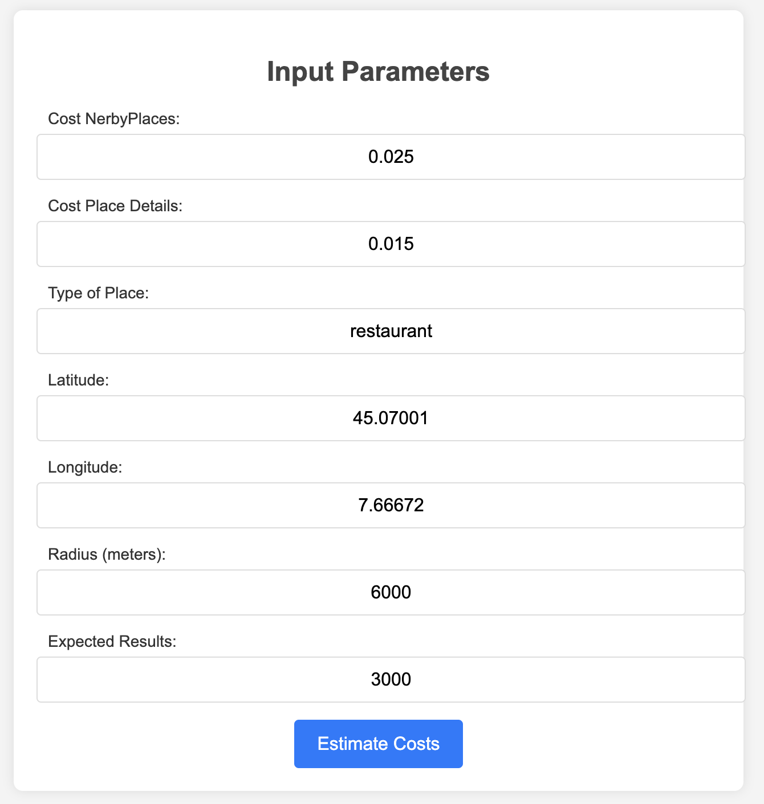
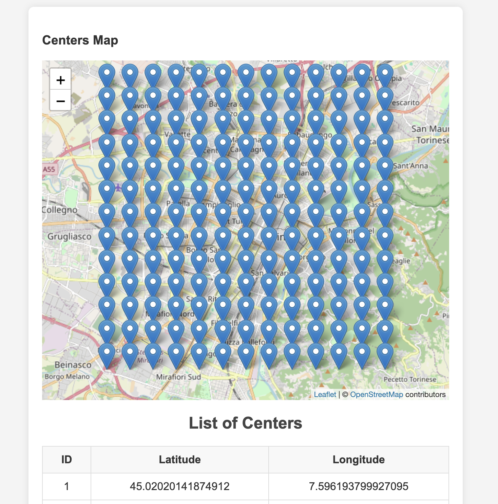
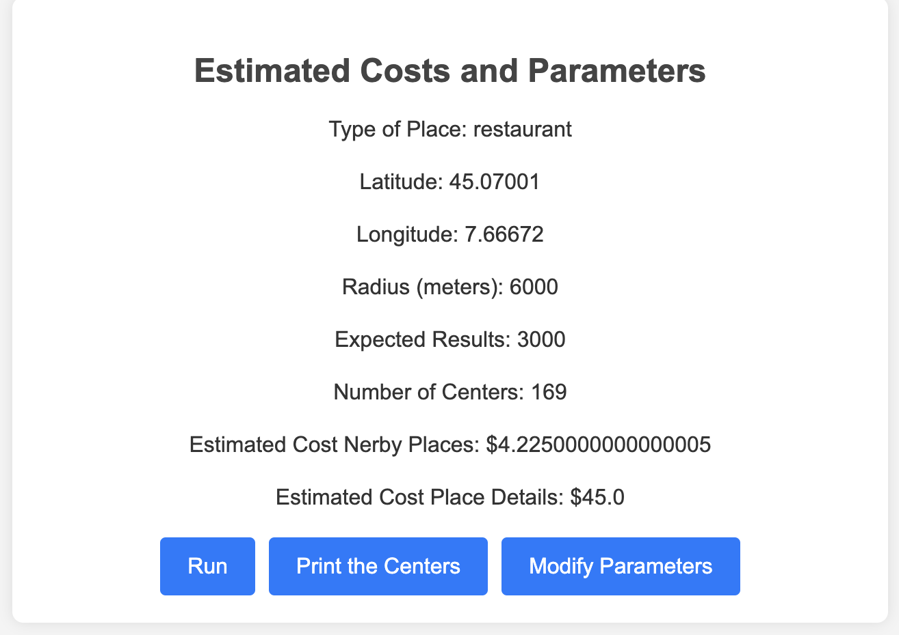

## Why this app?
This app helps you collect batch data from Google Maps API. 
The limitation of this APIs is that the "search nerby" call around a center, gives you a maximum of 60 places results, divided in pagination by 20 results for page. 

The solution of this is to split the search in several sub-centers, and collects the data from each sub-center.

## Instructions to run the app

First of all, before to run the app, add your YOUR_API_KEY_GOOGLE in the `credentials.json` file (and username and password to access the app). The token must have rights to call the Google Maps API.
Then run the app with the command:

```
python maps_api_app.py
```


The app will show you a form with "input parameters" to fill in, based on your needs. 
The most important parameters are the latitude and longitude, that is the center of your search. Then, it depends on how many results you espect (es 3k restaurant results) and radius of the search. The app will calculate a list of several sub-centers to apply several `maps/place/nearbysearch` requests.  
When all the places are collected, then the system will collect info using the `maps/place/details`.

Before to run the script the app will show you a page with a preview on how much the API will cost you. And where are all the calculated centers.

## Some screenshots of the app

### Input Parameters
Some parameters to fill, before to run the script. The cost is estimated based on the number of requests that will be made.

<p align="center">
  
</p>


### Preview of the calculated centers


<p align="center">
  
</p>

### Cost Estimation


The cost is estimated based on the number of requests that will be made, and the parameters of the requests. Check the [Google Maps API](https://developers.google.com/maps/documentation/places/web-service/usage-and-billing) for more information.


<p align="center">
  
</p>


