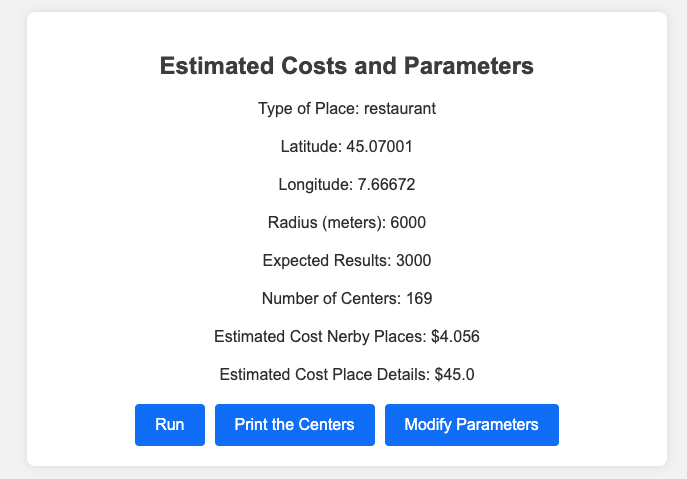

## Why this app?
This app helps you collect batch data from Google Maps API. 
The limitation of this APIs is that the "search nerby" call around a center, gives you a maximum of 60 places results, divided in pagination by 20 results for page. 

The solution of this is to split the search in several sub-centers, and collects the data from each sub-center, with the radius equivalent to the distance between the sub-centers. In this way it is possible to have duplicate values but the script will save and list only unique places. 

## Instructions to run the app

First of all, before to run the app, add your `YOUR_API_KEY_GOOGLE` in the `credentials.json` file (and `username` and `password` to access the app). The token must have rights to call the Google Maps API.
Then run the app with the command:

```
python maps_api_app.py
```


The app will show you a form with "input parameters" to fill in, based on your needs. 
The most important parameters are the latitude and longitude, that is the center of your search. The "Type of Place" input are available in API documentation (restaurant is the default value).

The app will calculate a list of several sub-centers to apply `maps/place/nearbysearch` requests.  
When all the places are collected, then the system will collect more detailed info using the `maps/place/details`.

Before to run the script you can see a page with a preview on how much the API will cost you. And where are all the calculated centers with the "print centers" command.

## Some screenshots of the app

### Input Parameters
Some parameters to fill, before to run the script. The radius is important to setup the grid search area. 
There are also manual parameters "Cost Nerby Places" and "Cost Place Details". 
The default are: 
*  0.025€/unit for `maps/place/nearbysearch` 
*  0.017€/unit for  `maps/place/details`

Check the [Google Maps API](https://developers.google.com/maps/documentation/places/web-service/usage-and-billing) for more informations.


<p align="center">
  
</p>


### Preview of the calculated centers
In this page you can have a preview of the grid search with all the sub-centers calculated by the script. 

<p align="center">
  
</p>

### Cost Estimation


The cost is estimated based on the number of requests that will be made, and the costs parameters of the requests that you filled in the "Input Parameters" page.


<p align="center">
  
</p>


## Output Results 

The results are two files: 

* results.json
* results.csv 

When the script finish the job, automatically the download of    `results.csv` will start. The `results.json` will be available in you local environment.

In this version the fields in the output will be 

* address 
* rating_count 
* rating 
* formatted_phone_number 
* website 
* lat 
* long 
* types


